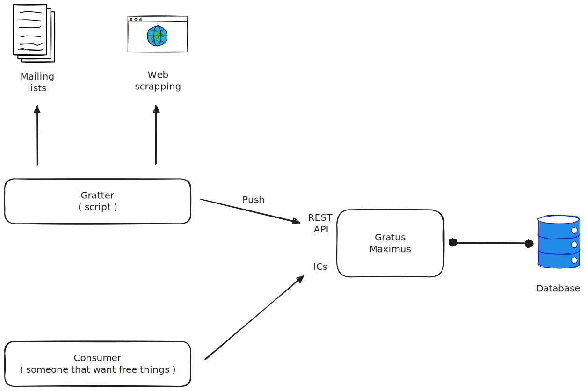

# Gratus Maximus

A free food finder with an ICS frontend.

Never run out of free events to attend !

## ToDo list

- [x] Database setup
- [ ] Maximus accept and store events
  - [x] Event model
  - [x] API key
  - [ ] Database storage
- [ ] gratter python sdk
- [ ] implement a simple gratter
- [ ] ICS frontend

## Software architecture

The software is divided into two main parts:

- Maximus: the backend that store events and provide an ICS frontend
- Some gratters: simple scripts that can push events to Maximus

### Gratters

Gratters are simple scripts that can push events to Maximus. They are written in any language and can be run on any machine. The only requirement is that they can send a POST request to Maximus with an API key that is stored inside the database.

#### Gratters todo list

Here is the list of the implemented and planned gratters:

- [ ] [Meetup](https://www.meetup.com/)
- [ ] [Eventbrite](https://www.eventbrite.com/)
